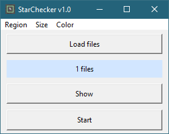
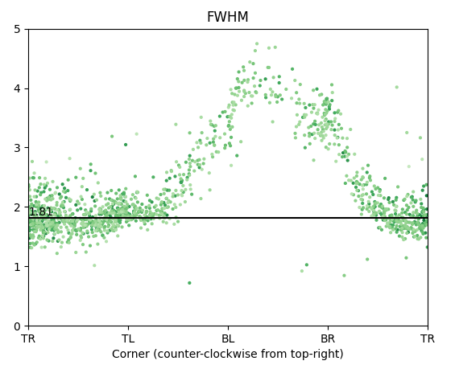
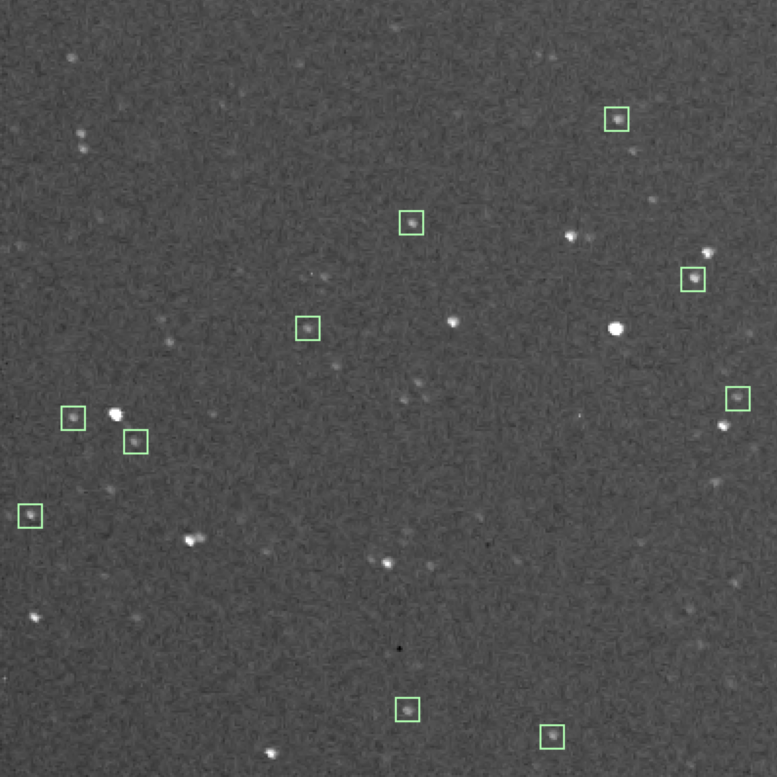
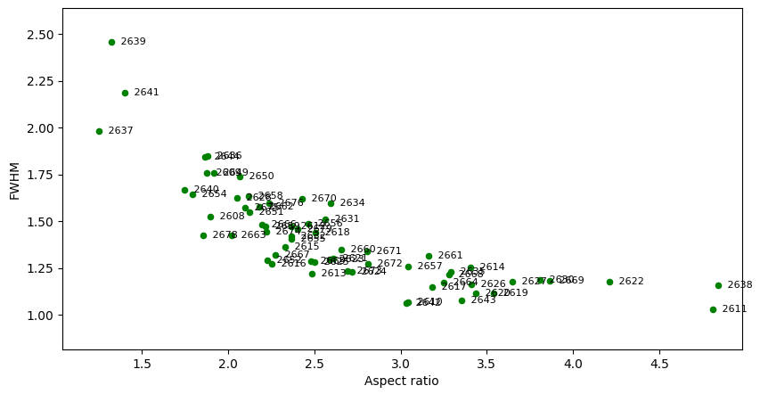

## StarChecker 

Program to detect and analyze stars in TIF oder RAW astro images.

### Start

**Using python**  
For all required packages listed in the header of **FilePlotter.py**, check if they are installed in your python distribution (`python -m pip show <package>`) and install if not (`python -m pip install <package>`). If all requirements are installed, execute `python FilePlotter.py`. 

**Executable for windows users**  
For windows users, a ZIP-file with a compiled program is available under Releases. Download, unzip and execute **FilePlotter.exe**.

### Process
The stars are detected by searching for local maxima with intensities well above the image mean. The stars are then analyzed by fitting 2D elliptical gaussians. While the smaller width parameter and the derived FWHM serves as a measure for the sharpness of the image, the larger width parameter with respect to the smaller one leads to an aspect ratio that serves as a measure for the tracking precision.

 

### Single image mode
The star parameters can be used to analyze regions within a single image, as the following screenshots show. With the region-option "edge", only stars close to the edge are analyzed and their parameters are plotted against their position in the image. Clearly, FWHM and aspect ratio depend on the position, which means some corners of the image show worse or better quality. In this example, the top left (TL) corner (left star image) has the best sharpness but lacks tracking precision, while for the bottom left (BL) corner (right star image) the parameters are vice versa. This visual difference between the two corner images is quantitatively represented in the star fitting data above.

 

 

### Multiple images mode 
If more than one file is selected, the mean star parameters are exported in a CSV file and are displayed in a graphic, labelled by numbers extracted from the respective filenames (simple integer count if none present). With this data, images can be selected by quality for subsequent processing (stacking).

